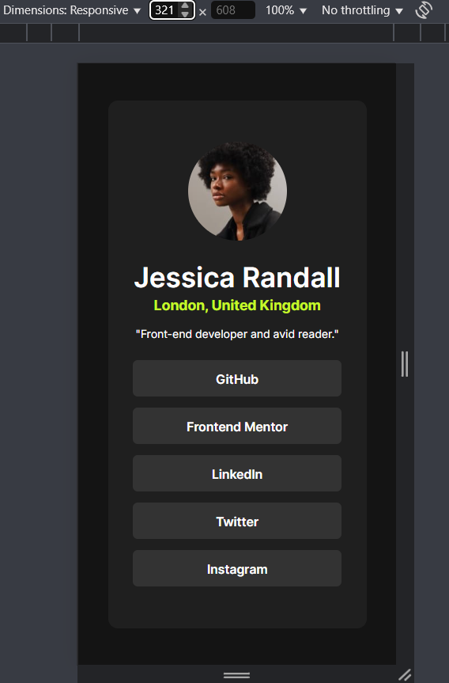
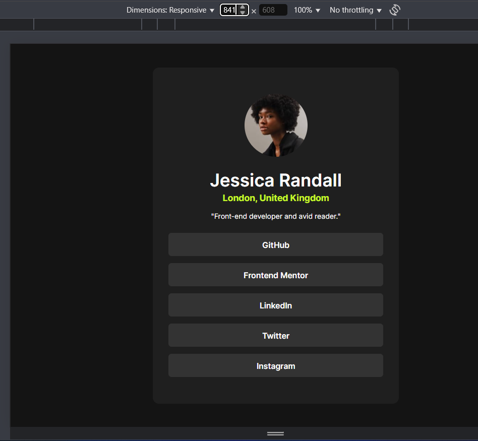

# Frontend Mentor - Social links profile solution

This is a solution to the [Social links profile challenge on Frontend Mentor](https://www.frontendmentor.io/challenges/social-links-profile-UG32l9m6dQ). Frontend Mentor challenges help you improve your coding skills by building realistic projects.

## Table of contents

- [Overview](#overview)
  - [The challenge](#the-challenge)
  - [Screenshot](#screenshot)
  - [Links](#links)
- [My process](#my-process)
  - [Built with](#built-with)
  - [What I learned](#what-i-learned)
  - [Continued development](#continued-development)
  - [Useful resources](#useful-resources)
- [Author](#author)
- [Acknowledgments](#acknowledgments)

## Overview

### The challenge

Users should be able to:

- See hover and focus states for all interactive elements on the page

### Screenshot




### Links

- Solution URL: (https://www.frontendmentor.io/solutions/social-links-project-mahmoud-elrasool-8qO2iFCFdT)
- Live Site URL: (https://social-links-profile-mahmoud-elrasool-n0atb1duw.vercel.app)

## My process

### Built with

- Semantic HTML5 markup
- CSS custom properties
- Flexbox
- Mobile-first workflow

### What I learned

I learned how to use mobile-first approach and to add custom styling for every breakpoint.

```css
@media (min-width: 768px) {
  body {
    height: 100vh;
  }

  main {
    max-width: 50%;
  }
}

@media (min-width: 1024px) {
  body {
    height: 100vh;
  }

  main {
    max-width: 40%;
  }
}
```

### Continued development

Use this section to outline areas that you want to continue focusing on in future projects. These could be concepts you're still not completely comfortable with or techniques you found useful that you want to refine and perfect.

I need to deeply understand responsiveness and accessibility.

## Author

- Frontend Mentor - [Mahmoud Elrasool](https://www.frontendmentor.io/profile/Mahmoud Elrasool)
